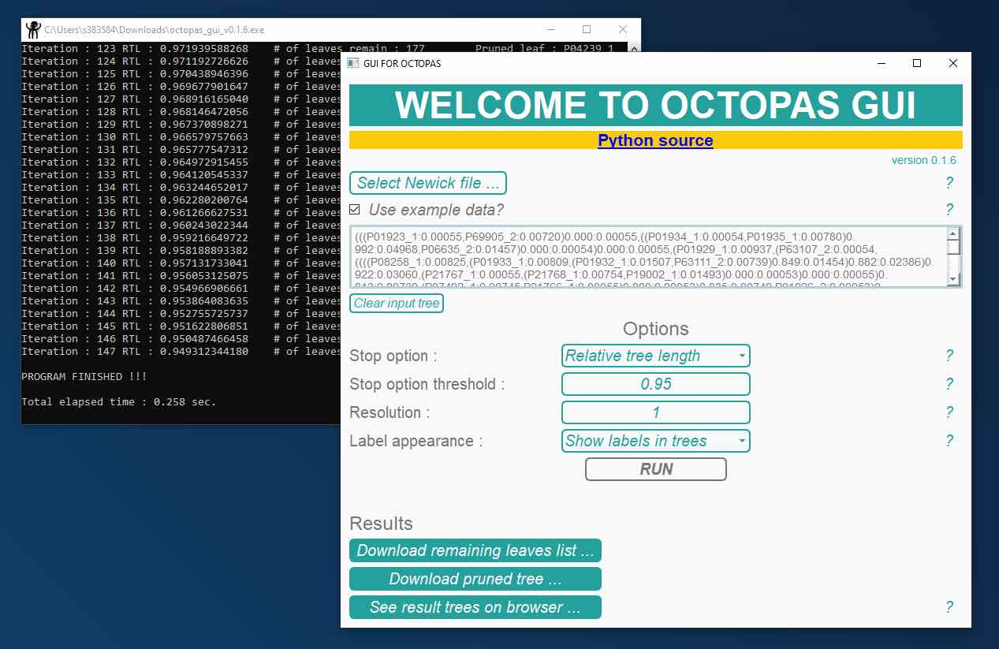

# GUIforOCTOPAS

This is GUI version of OCTOPAS ([https://github.com/shin-kinos/OCTOPAS](https://github.com/shin-kinos/OCTOPAS)). OCTOPAS is fast and high-performace Python tool which can 'prune' a large size and redandunt phylogenetic datasets by referencing their parent nodes.

## Dependencies 

* Python (`v3.9` or more)
* PyQt6 (`v6.5` or more, [https://pypi.org/project/PyQt6/](https://pypi.org/project/PyQt6/))
* phylotreelib (`v1.18` or more, [https://pypi.org/project/phylotreelib/](https://pypi.org/project/phylotreelib/)) 
* Toytree (`v2.0` or more, [https://pypi.org/project/toytree/](https://pypi.org/project/toytree/))

## Installation 

**OCTOPAS GUI executables are now available on Windows and MacOS;**

* Windows 
* MacOS 

Download the binary files from the links above, and implement them on your environment. 

If you would like to get the Python source and implement the OCTOPAS GUI on your own, please reference the 

The OCTOPAS GUI requires `PyQt6`, `phylotreelib` and `Toytree` modules. So, if necessary, install them by using `pip` command:

[e.g.]

```
% pip install PyQt6
% pip install phylotreelib
% pip install toytree
```

Download `octopas_gui` directory and activate OCTOPAS GUI by typing as follows:

[e.g.]

```
% cd octopas_gui
% python3 octopas_gui.py
```

✅**NOTE** that `example.py`, `pruner.py`, `stylesheet_for_qt.py`, `utils.py` and `viewer.py` on `octopas_gui.py` directory **must be located on the same directory where `octopas_gui.py` is on**. Therefore, do not move them onto any other directories.

Or, you can create a binary executable file by using `Pyinstaller` module:

[e.g]

```
% cd octopas_gui
% pyinstaller --onefile octopas_gui.py
```

Then, the directory `dist` should be generated on the current directory and you can find the executable file named `octopas_gui.exe` or `octopas_gui`.

## Implementation 

### The main window

Once you activate OCTOPAS GUI, the main window of the GUI should appear with a terminal which records execution logs. The termial window monitors what exactly the program is doing. 



### Input file format

The input file format must be Newick. If you do not familiarise Newick data or do not have any Newick trees. Press the check box buttton *`☐Use example data?`* so that the program will provide a demo data. 

### Options 

4 types of option are available in OCTOPAS GUI:

| Option                | Description                                                              |
| :---                  | :---                                                                     |
| Stop option           | The program stop option (`NL` or `RTL`)                                  |
| Stop option threshold | The threshold of stop option, default `0.95` of `RTL`                    |
| Resolution            | Number of how many leaves will be pruned in one iteration                |
| Label appearance      | If leaves information appears when hover over leaves of the result trees |

You can hover over the **`?`** marks at the right side of the main window to more detailed information about each option.

### Output 

Once you push ***`RUN`*** button then calculation begins. After finish calculation, 3 types of information as output are available. 1) A list of remaining leaves throughout calculation in text format can be by pushing *`Download remaining leaves list`* button. 2) Pushing *`Download pruned tree`* also provides the result runed phylogenetic tree in Newick format. 3) In addition to them, You can get a quick view of the result phylogenetic trees on your browser when you push *`See result trees on browser`* button. If *`Label appearance option`* is set at *`Show labels in trees`*, detailed information of leaves such as leaf name and branch lengh will appear when you hover over each leaf. ✅**NOTE** that this result tree viewer will show 2 phylogenetic trees; the top one is the original input tree and the bottom one is the output prined tree.


## Queries, issues and reports

If you have any inquiries, requests for new functionalities, reports on errors, or concerns related to the most recent release of OCTOPAS GUI, kindly utilise the issues section positioned at the upper-left corner of the GitHub repository.
